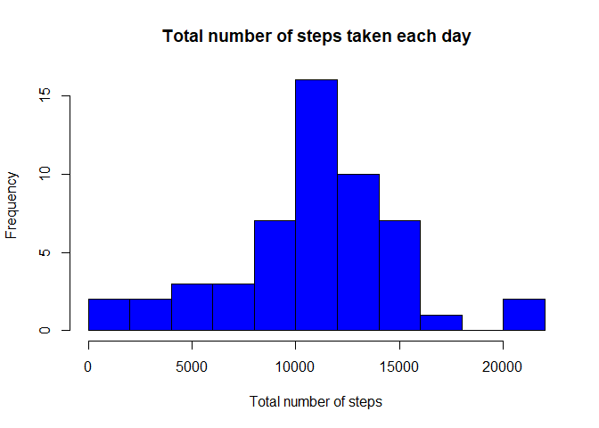
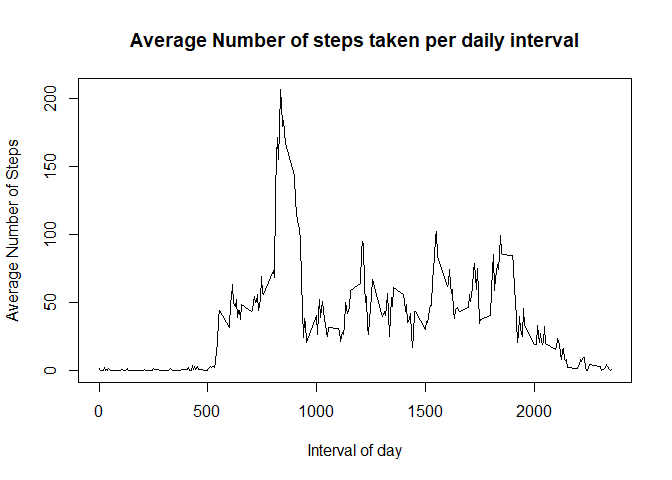
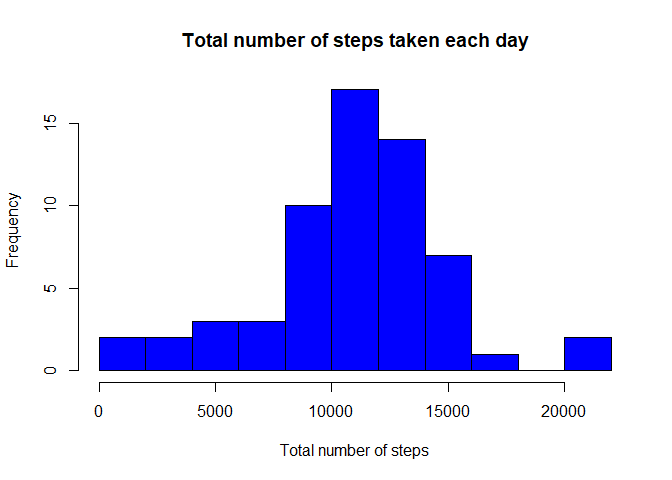
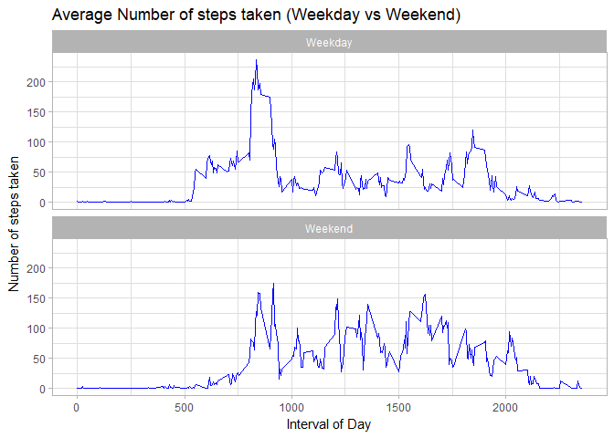

## Assignment and Background
This assignment is to analyse data from a personal activity monitoring device available via url [Activity monitoring data]( https://d396qusza40orc.cloudfront.net/repdata%2Fdata%2Factivity.zip).
The device collects data at 5 minute intervals through out the day. The data consists of two months of data from an anonymous individual collected during the months of October and November, 2012 and include the number of steps taken in 5 minute intervals each day.

The analysis shall include:  
- Code for reading in the dataset and/or processing the data  
- Histogram of the total number of steps taken each day  
- Mean and median number of steps taken each day  
- Time series plot of the average number of steps taken  
- The 5-minute interval that, on average, contains the maximum number of steps  
- Code to describe and show a strategy for imputing missing data  
- Histogram of the total number of steps taken each day after missing values are imputed  
- Panel plot comparing the average number of steps taken per 5-minute interval across weekdays and weekends  
- All of the R code needed to reproduce the results (numbers, plots, etc.) in the report  

The result of the assignment is available on GitHub repository 
[RepData_PeerAssessment1](https://github.com/snenning/RepData_PeerAssessment1).


## Analysis and Results

Initial set up

```r
knitr::opts_chunk$set(echo = TRUE)
      
library(plyr)
library(dplyr)
```

```
## 
## Attaching package: 'dplyr'
```

```
## The following objects are masked from 'package:plyr':
## 
##     arrange, count, desc, failwith, id, mutate, rename, summarise,
##     summarize
```

```
## The following objects are masked from 'package:stats':
## 
##     filter, lag
```

```
## The following objects are masked from 'package:base':
## 
##     intersect, setdiff, setequal, union
```

```r
library(ggplot2)
```


### Loading and preprocessing the data
First, the dataset is downloaded, file unziped and loaded to R and assign it to df 'activity'. The date and time of download is recorded.

```r
# download.file("https://d396qusza40orc.cloudfront.net/repdata%2Fdata%2Factivity.zip", "activity.zip")  ##denoted to skip download
unzip("activity.zip", "activity.csv")
# print(paste("File download at:", Sys.time()))                   ##denoted since download skipped
activity <- read.table("activity.csv", header = TRUE, na.strings = "NA", sep = ",")
```

The loaded dataframe 'activity' is of following structure ((missing values are coded as NA)

```r
str(activity)
```

```
## 'data.frame':	17568 obs. of  3 variables:
##  $ steps   : int  NA NA NA NA NA NA NA NA NA NA ...
##  $ date    : Factor w/ 61 levels "2012-10-01","2012-10-02",..: 1 1 1 1 1 1 1 1 1 1 ...
##  $ interval: int  0 5 10 15 20 25 30 35 40 45 ...
```


### What is mean total number of steps taken per day?
The total number of steps taken per day is calculated first using aggregate() function. The histogram shows the frequency of days for total number of steps taken.

```r
activity_day <- aggregate(steps ~ date, activity, sum, na.rm = TRUE)
hist(activity_day$steps, breaks = 10, xlab = "Total number of steps",  main = "Total number of steps taken each day", col = "blue")
```

<!-- -->


The mean and median number of steps taken per day is calculated with following values:

```r
steps_mean <- mean(activity_day$steps)
steps_median <- median(activity_day$steps)
print(paste0("Mean number of steps taken: ", steps_mean))  
```

```
## [1] "Mean number of steps taken: 10766.1886792453"
```

```r
print(paste0("Median number of steps taken: ", steps_median))
```

```
## [1] "Median number of steps taken: 10765"
```

### What is the average daily activity pattern?
Average number of steps taken in 5-minutes intervals is calculated and ploted as time series. Records with missing values are removed.

```r
activity_interval <- aggregate(steps ~ interval, activity, mean, na.rm = TRUE)
plot( activity_interval$interval, activity_interval$steps, xlab = "Interval of day", ylab = "Average Number of Steps", type = "l", main = "Average Number of steps taken per daily interval")
```

<!-- -->

The 5-minute interval that, on average, contains the maximum number of steps is identified by restricting dataframe with activity interval on max number of steps.

```r
activity_interval[activity_interval$steps==max(activity_interval$steps),]
```

```
##     interval    steps
## 104      835 206.1698
```


### Imputing missing values
The data set contains missing values for 'steps'. First step is to determine the number of records with missing values.  
Missing 'steps' values will be imputed with the average number of steps for the same 'interval' and 'day of week'. In order to do so, a new column "dayofweek" is introduced and values assigned using weekdays() function. This is done in a duplicated dataframe 'activity_weekdays'.

```r
print(paste0("Number of records with missing values: ",sum(is.na(activity$steps))))
```

```
## [1] "Number of records with missing values: 2304"
```

```r
#creating new dataframe for cleansed data with addtional day of week column
activity_weekdays <- activity  
activity_weekdays$dayofweek <- weekdays(as.Date(activity_weekdays$date))
      
#creating df with average number of steps by day of week and interval
activity_weekdays_interval <- ddply(activity_weekdays[!is.na(activity_weekdays),], c("dayofweek","interval"), summarise, avg=mean(steps))
      
# adding average calculated to "activity_weekday" df using left join, and update missing steps values with average
activity_weekdays <- left_join(activity_weekdays, activity_weekdays_interval, by = c("dayofweek", "interval"))
activity_weekdays[is.na(activity_weekdays$steps),]$steps <- activity_weekdays[is.na(activity_weekdays$steps),]$avg
      
#print number records with missing step values after imputing
print(paste0("Number of records with missing values after imputing: ",sum(is.na(activity_weekdays$steps))))
```

```
## [1] "Number of records with missing values after imputing: 0"
```

The mean and median number of steps taken per day is calculated and printed

```r
activity_weekdays_day <- aggregate(steps ~ date, activity_weekdays, sum, na.rm = TRUE)
steps_mean_c <- mean(activity_weekdays_day$steps)
steps_median_c <- median(activity_weekdays_day$steps)
print("Mean and median after imputing values")
```

```
## [1] "Mean and median after imputing values"
```

```r
print(paste0("Mean number of steps taken: ", steps_mean_c))  
```

```
## [1] "Mean number of steps taken: 10821.2096018735"
```

```r
print(paste0("Median number of steps taken: ", steps_median_c))  
```

```
## [1] "Median number of steps taken: 11015"
```

```r
print("In comparison, mean and median before imputing values")
```

```
## [1] "In comparison, mean and median before imputing values"
```

```r
print(paste0("Mean number of steps taken: ", steps_mean))  
```

```
## [1] "Mean number of steps taken: 10766.1886792453"
```

```r
print(paste0("Median number of steps taken: ", steps_median))
```

```
## [1] "Median number of steps taken: 10765"
```

After dataframe with missing values has been imputed, the total number of steps taken per day is calculated again. The histogram shows the frequency of days for total number of steps taken.

```r
activity_weekdays_day <- aggregate(steps ~ date, activity_weekdays, sum)
hist(activity_weekdays_day$steps, breaks = 10, xlab = "Total number of steps",  main = "Total number of steps taken each day", col = "blue")
```

<!-- -->


### Are there differences in activity patterns between weekdays and weekends?
A new column "Weekday" (as a factor) is added to differentiate between weekday and weekend; value assignment is based on the "dayofweek" column introduced earlier. ggplot2 is used to plot average number of steps taken per 5-minute interval with "weekday" column as facet.

```r
#set all days to 'Weekday' first and update Sat and Sun to 'Weekend'
activity_weekdays$weekday <- "Weekday"
activity_weekdays[activity_weekdays$dayofweek %in% c("Saturday","Sunday"),]$weekday <- "Weekend"
activity_weekdays$weekday <- as.factor(activity_weekdays$weekday)
      
activity_weekdays_interval <- ddply(activity_weekdays, c("weekday","interval"), summarise, steps_avg=mean(steps))
    
# plot data
ggplot( data = activity_weekdays_interval, aes(interval, steps_avg)) + geom_line(color = "blue") + facet_wrap(~weekday, nrow = 2, strip.position = "top") + theme_light() + labs(title = "Average Number of steps taken (Weekday vs Weekend)", x = "Interval of Day", y= "Number of steps taken")
```

<!-- -->

